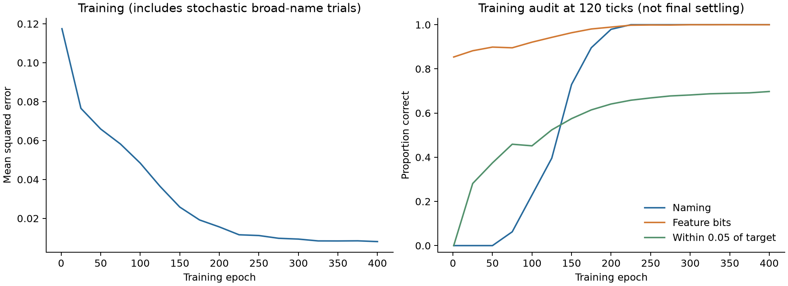
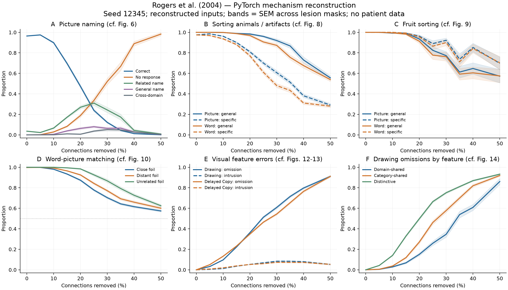
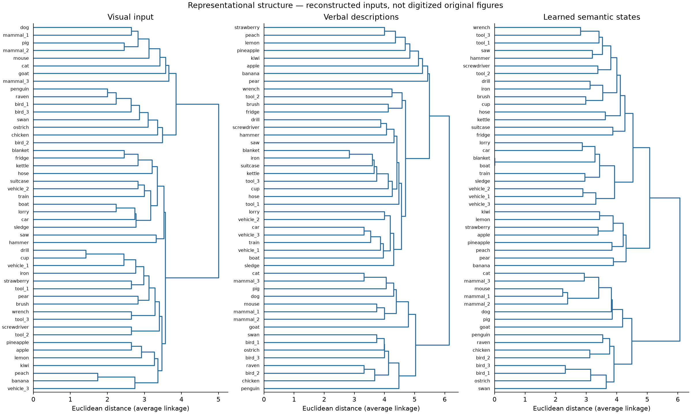

# Measured reconstruction results

**This is a mechanism reconstruction with newly generated feature vectors, not an exact reproduction of the published curves.**

Training: seed=12345, data seed=2004, epochs=400, learning rate=0.005, gradient scale=1.0.

## Intact network

- naming_accuracy: 0.979167
- unique_naming_accuracy: 0.972222
- feature_bit_accuracy: 0.996773
- within_005_fraction: 0.695917
- max_error: 0.997143
- mse: 0.005764
- settle_residual: 0.000010
- settle_ticks: 1073.000000
- nonconvergent_inputs: 0.000000

Intact exact-naming criterion: NOT MET. All audited outputs within 0.05: NOT MET. Qualitative lesion effects below do not override these failures.

The within-0.05 audit excludes ambiguous general-name cues, whose targets vary by trial. It includes all visual and verbal cues. This fraction must not be confused with all units passing the paper criterion.

## Paper predictions compared with this run

| Measure | Actual simulation | Published qualitative expectation |
|---|---|---|
| Naming at 20% lesion | 0.473 | Declines with damage |
| Picture sorting: general minus specific (20%) | +0.174 | Positive |
| Fruit picture sorting: specific minus general (20%) | +0.027 | Positive (reversal) |
| Matching: close / distant / unrelated (20%) | 0.874 / 0.926 / 0.984 | Increasing |
| Drawing: distinctive minus domain-shared omissions (20%) | +0.348 | Positive |
| Drawing minus delayed-copy total errors (20%) | +0.047 | Positive; eligible items differ as in paper |

Maximum mean final-tick residual over lesion levels: 0.00147956. Evaluation allows up to 2000 ticks and stops after four consecutive updates smaller than 1e-5. Raw CSV includes nonconvergent input counts; capped trials must not be described as proven fixed points.

**Convergence limitation:** 50/451 trials reached the cap with at least one unsettled input; 40 had unsettled visual inputs. These trials remain in the plots (not silently discarded), so the curves are finite-time responses where convergence failed. The intact network has 0 unsettled inputs.

Earlier fixed-200-tick summaries are retained in `summary_200ticks.json` for the settling sensitivity check. The original training source is retained as `training_source.py`, matching the training hash in config.json. Final evaluation code has its own hash in evaluation_config.json.

Error bands are standard errors over lesion masks for one trained network. They are not patient uncertainty or between-training-seed uncertainty. No patient measurements were fabricated, digitized, or fitted.

See `notes/ROGERS2004_NOTES.md` for every reconstruction choice and known limitations.

