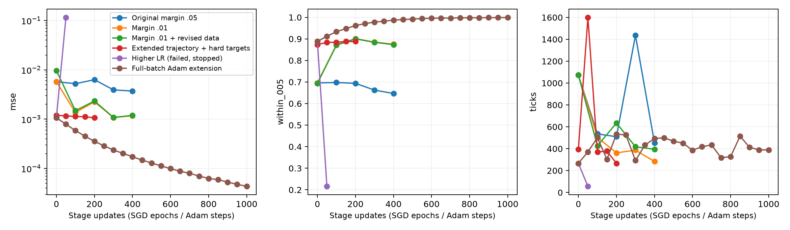
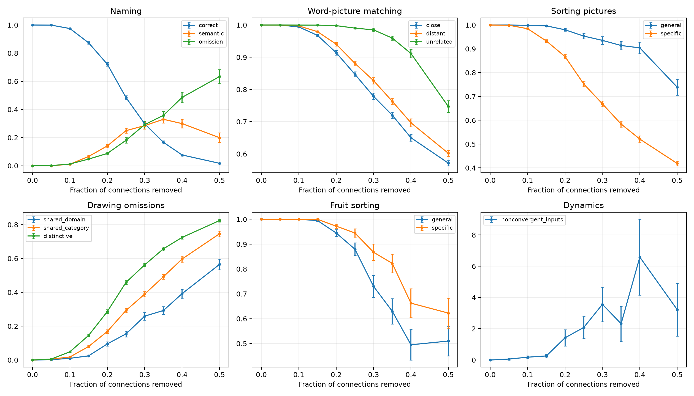

# 继续训练与输入修订实验

原有 `paper_settings` 结果保持不变。三组均从原始400轮权重继续训练；前200轮学习率0.005，后200轮0.002。选择依据是完整网络表现，未使用损伤曲线选参数。

|实验|新增轮数|命名正确率|特征判断正确率|误差<0.05比例|最大误差|未稳定输入|
|---|---:|---:|---:|---:|---:|---:|
|continue|400|100.00%|99.898%|64.67%|0.9751|0|
|tight|400|100.00%|100.000%|87.53%|0.3171|0|
|data|400|100.00%|100.000%|87.36%|0.2689|0|
|stable|200|100.00%|100.000%|88.78%|0.2541|0|
|stable_long|50|0.00%|85.304%|21.60%|0.9847|0|
|adam|1000|100.00%|100.000%|99.91%|0.1066|0|

输入修订只改动8个非标签百科特征：取消重复的概率性动物/人工物标签，并补入图3所示水果共享的4个特征；精确类别标签、名称、视觉输入和随机抽样数保持不变。图3与正文存在其他歧义，因此仍是重建数据，不能称为原始数据。

容差0.01改变了训练目标，并非论文参数的原样复现。小于0.05的统计排除一般名称的歧义线索；命名与稳定性均采用最长2000步的完整网络评估。数据组在旧数据权重基础上继续学习，属于适应实验，不代表从头训练的独立复现。

稳定性扩展组 stable 从 data 组继续：展开56步，对21—56步评分，硬目标0/1与0.01误差死区，学习率0.002。它同时修改了时间展开和目标形式，不能单独归因于其中一项。横轴是各阶段新增轮数；stable 的起点已额外训练400轮。

stable_long 提高学习率到0.005后崩溃，提前停止；不是已完成800轮。adam 从 stable 权重开始，使用全批量Adam (lr=0.001)、56步展开、一般名称的平均特征目标和二元交叉熵。这些都是明确的优化扩展；其横轴是全批量更新次数，不是原来的逐样本SGD轮数。

选用实验：**adam**。选择记录：`selection.json`。

独立损伤随机种子1707，每档50个掩码，共451次评估；92次包含未稳定输入。全部保留，不因不稳定而删除。

|20%损伤指标|实测均值|
|---|---:|
|naming/all/correct|72.14%|
|matching/close|91.42%|
|matching/distant|94.07%|
|matching/unrelated|99.81%|

局限：仅一个初始化和一个环境种子；未拟合患者数据。完整网络表现改善不等于所有损伤状态都稳定，也不等于满足全部原论文数值标准。原始论文与当前曲线没有数字化逐点比较。